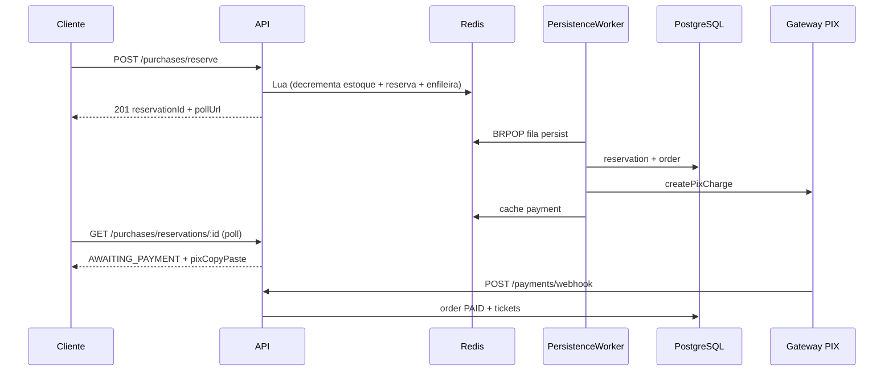

# API de Ingressos — Express + TypeORM + Redis

API backend para venda de ingressos com **reserva atômica no Redis**, persistência assíncrona no PostgreSQL, pagamento PIX (simulado) e emissão de tickets com suporte a Apple/Google Wallet.

## Stack

- **Node.js 20+**, **Express 5**, **TypeScript**
- **PostgreSQL** + **TypeORM** (migrations)
- **Redis** (estoque, cache, filas, rate limit, TTL de reservas)
- **JWT** para autenticação
- Workers em processo: persistência de reservas + expiração

## Arquitetura (fluxo de compra)



## Início rápido

### Docker (recomendado)

```bash
docker compose up -d --build
docker compose run --rm migrate
```

API disponível em `http://localhost:3000`.

### Local (dev)

```bash
cp .env.example .env
npm install
npm run migration:run
npm run seed          # reseta DB + Redis e popula dados demo
npm run dev
```

### Dados de demonstração (`npm run seed`)

| Papel | E-mail | Senha |
|-------|--------|-------|
| ADMIN | `admin@ticketflow.com.br` | `123456` |
| PRODUCER | `producer@ticketflow.com.br` | `123456` |
| CLIENT | `client@ticketflow.com.br` | `123456` |

Inclui 2 eventos publicados + 1 rascunho, estoque no Redis e 3 ingressos de exemplo para o cliente (2 ativos com QR, 1 já usado no check-in).

```bash
npm run seed:keep   # não apaga o banco; aborta se os usuários demo já existirem
```

### Seed no Railway

O seed precisa de **Postgres** (`DATABASE_URL`) e **Redis** (`REDIS_URL`) do mesmo projeto Railway.

**Opção A — da sua máquina (recomendado):**

```bash
cd backend
npm install
railway link          # selecione o projeto e o serviço da API
railway run npm run seed
```

**Opção B — no container após deploy:**

```bash
railway ssh
node dist/seeds/run.js
```

**Opção C — variáveis manuais (sem CLI):**

```bash
cd backend
# Cole DATABASE_URL e REDIS_URL do painel Railway no .env ou exporte no terminal
npm run migration:run
npm run seed
```

> `npm run seed` **apaga** todas as tabelas principais e o Redis (`TRUNCATE` + `FLUSHDB`) antes de popular. Use `npm run seed:keep` para não truncar (só insere se os usuários demo ainda não existirem).

## Variáveis de ambiente

Copie `.env.example` para `.env`. Principais variáveis:

| Variável | Descrição |
|----------|-----------|
| `PORT` | Porta da API (padrão `3000`) |
| `CORS_ORIGINS` | Origens permitidas no browser (ex.: `http://localhost:5173`) |
| `JWT_SECRET` | Segredo do JWT |
| `PAYMENT_GATEWAY` | `simulated` (padrão) ou `mercadopago` |
| `PAYMENT_WEBHOOK_SECRET` | Segredo HMAC do webhook interno |
| `WEBHOOK_MAX_AGE_SECONDS` | Janela anti-replay (padrão `300`) |
| `MERCADOPAGO_ACCESS_TOKEN` | Access token Mercado Pago (sandbox ou prod) |
| `MERCADOPAGO_WEBHOOK_SECRET` | Segredo de assinatura do painel Mercado Pago |
| `MERCADOPAGO_NOTIFICATION_URL` | URL pública do webhook (IPN) |
| `DB_*` | Conexão PostgreSQL |
| `REDIS_*` | Conexão Redis |
| `APPLE_*` / `GOOGLE_WALLET_*` | Credenciais Wallet (opcional) |

> Em produção, **`PAYMENT_WEBHOOK_SECRET` é obrigatório** — sem ele o webhook retorna 401.

## Roles

| Role | Permissões |
|------|------------|
| `CLIENT` | Comprar, ver pedidos/ingressos, wallet dos próprios tickets |
| `PRODUCER` | Gerenciar **seus** eventos/lotes, check-in nos seus eventos, ops |
| `ADMIN` | Tudo (qualquer evento, promover usuários, ops) |

Cadastro público sempre cria usuário como `CLIENT`. Promoção via `PATCH /auth/users/:userId/role` (ADMIN).

---

## Health check

### `GET /health`

Verifica dependências críticas e estado operacional.

**Resposta (200 = ok/degraded, 503 = down):**

```json
{
  "status": "ok",
  "timestamp": "2026-05-26T21:00:00.000Z",
  "components": {
    "postgres": { "status": "ok", "latencyMs": 3 },
    "redis": { "status": "ok", "latencyMs": 1 },
    "worker": {
      "status": "ok",
      "running": true,
      "metrics": {
        "processedCount": 120,
        "failedCount": 2,
        "retryScheduledCount": 1,
        "dlqCount": 0
      }
    },
    "queues": {
      "status": "ok",
      "persistQueueLength": 0,
      "retryQueueLength": 0,
      "dlqLength": 0,
      "retryScheduled": 0,
      "alerts": []
    }
  }
}
```

- **`down`**: Postgres ou Redis indisponível → HTTP **503**
- **`degraded`**: worker parado, DLQ com jobs, retries atrasados ou backlog alto → HTTP **200** (com alertas)

---

## Autenticação

Envie JWT no header:

```
Authorization: Bearer <token>
```

### Endpoints

| Método | Rota | Auth | Descrição |
|--------|------|------|-----------|
| POST | `/auth/register` | — | Cadastro (`CLIENT`) |
| POST | `/auth/login` | — | Login → JWT |
| GET | `/auth/me` | JWT | Perfil do usuário logado |
| PATCH | `/auth/users/:userId/role` | ADMIN | Promover role |

---

## Eventos e lotes

| Método | Rota | Auth | Descrição |
|--------|------|------|-----------|
| GET | `/events` | — | Lista eventos `PUBLISHED` + lotes |
| GET | `/events/:eventId` | — | Detalhe evento publicado |
| GET | `/events/mine` | PRODUCER/ADMIN | Eventos gerenciáveis |
| POST | `/events` | PRODUCER/ADMIN | Cria evento (`DRAFT`) |
| PATCH | `/events/:eventId` | PRODUCER/ADMIN* | Atualiza evento/status |
| POST | `/events/:eventId/lots` | PRODUCER/ADMIN* | Cria lote |

\* PRODUCER só gerencia eventos onde `producer_id` = seu user id.

**Criar lote (exemplo):**
```json
{
  "name": "Pista",
  "price": 5000,
  "totalQuantity": 1000,
  "availableQuantity": 1000
}
```
`price` em centavos.

---

## Compras (fluxo crítico)

| Método | Rota | Auth | Descrição |
|--------|------|------|-----------|
| POST | `/purchases/reserve` | CLIENT+ | Reserva ingressos (Redis) |
| GET | `/purchases/reservations/:id` | CLIENT+ | Status da reserva (poll) |

**Reservar:**
```json
{ "ticketLotId": "<uuid>", "quantity": 2 }
```

**Fases do poll (`phase`):**
`PENDING_PERSISTENCE` → `PENDING_PAYMENT` → `AWAITING_PAYMENT` → `PAID` | `EXPIRED` | `FAILED`

TTL da reserva e do PIX: **15 minutos**. Se o pagamento não for confirmado nesse prazo, o `ReservationExpiryWorker` marca o pedido como `FAILED`, expira a reserva e devolve o estoque (Redis + Postgres).

---

## Pagamentos

| Método | Rota | Auth | Descrição |
|--------|------|------|-----------|
| POST | `/payments/webhook` | secret | Webhook do gateway |
| POST | `/payments/dev/simulate` | JWT | Simula pagamento (só `development` + gateway `simulated`) |

### Gateway

| `PAYMENT_GATEWAY` | Comportamento |
|-------------------|---------------|
| `simulated` (padrão) | PIX fake para dev/testes |
| `mercadopago` | Cobrança PIX real via API Mercado Pago |

**Configurar Mercado Pago (sandbox):**

```env
PAYMENT_GATEWAY=mercadopago
MERCADOPAGO_ACCESS_TOKEN=TEST-xxxxxxxx
MERCADOPAGO_NOTIFICATION_URL=https://seu-dominio.com/payments/webhook
MERCADOPAGO_TEST_PAYER_EMAIL=test_user_XXXXX@testuser.com
PAYMENT_WEBHOOK_SECRET=seu-secret
```

Obtenha o access token em [Mercado Pago Developers](https://www.mercadopago.com.br/developers/panel/app) (credenciais de teste para sandbox).

### Webhook interno (simulado / testes manuais)

**Produção — HMAC obrigatório:**

Headers:
```
x-webhook-timestamp: <unix-ms>
x-webhook-signature: <hmac-sha256-hex>
```

Assinatura: `HMAC-SHA256(secret, "${timestamp}.${rawBody}")`

**Desenvolvimento:** aceita HMAC ou header legado `x-webhook-secret`.

**Payload:**
```json
{
  "event": "payment.succeeded",
  "data": {
    "orderId": "<uuid>",
    "transactionId": "pix_...",
    "paidAt": "2026-05-26T21:00:00.000Z"
  }
}
```

Eventos: `payment.succeeded` | `payment.failed`

**Anti-replay:** cada webhook é deduplicado via Redis por 24h (timestamp + hash do body, ou `x-request-id` no MP).

### Webhook Mercado Pago

A mesma rota `POST /payments/webhook` aceita notificações do Mercado Pago.

**Produção — assinatura obrigatória** (`x-signature` + `x-request-id`):

Manifest: `id:{data.id};request-id:{x-request-id};ts:{ts};`  
HMAC-SHA256 com `MERCADOPAGO_WEBHOOK_SECRET` (segredo do painel MP, não o access token).

Configure a URL de notificação com `?source_news=webhooks` para receber Webhooks v2 assinados (IPN legado não tem assinatura).

**Formato JSON (Webhooks v2):**
```json
{
  "type": "payment",
  "data": { "id": "123456789" }
}
```

**Formato IPN (query string):**
```
POST /payments/webhook?topic=payment&id=123456789
```

A API consulta o pagamento no Mercado Pago, usa `external_reference` como `orderId` e processa:
- `approved` → emite ingressos
- `rejected` / `cancelled` → falha pedido e restaura estoque
- `pending` → ignora (aguarda próxima notificação)

Configure no painel MP a URL de notificação apontando para `/payments/webhook` (preferir Webhooks v2 assinados).

---

## Pedidos e ingressos (cliente)

| Método | Rota | Auth | Descrição |
|--------|------|------|-----------|
| GET | `/orders/me` | CLIENT+ | Meus pedidos |
| POST | `/orders/:id/refund` | ADMIN | Reembolsa pedido pago |
| GET | `/tickets/me` | CLIENT+ | Meus ingressos |

### Reembolso (`POST /orders/:id/refund`)

Regras:

- Pedido deve estar **`PAID`**
- Ingressos **não podem** estar com check-in (`USED`)
- Cancela todos os tickets `ACTIVE` → `CANCELLED`
- Marca pedido como **`REFUNDED`**
- Restaura estoque no Postgres e Redis
- Com `PAYMENT_GATEWAY=mercadopago`, dispara reembolso na API do Mercado Pago antes de persistir

Resposta:

```json
{
  "refund": {
    "orderId": "<uuid>",
    "ticketsCancelled": 2,
    "stockRestored": 2
  }
}
```

Códigos de erro: `ORDER_NOT_FOUND` (404), `ORDER_ALREADY_REFUNDED` (409), `ORDER_NOT_REFUNDABLE` / `TICKET_ALREADY_USED` (422).

---

## Check-in

| Método | Rota | Auth | Descrição |
|--------|------|------|-----------|
| POST | `/tickets/check-in` | PRODUCER/ADMIN* | Valida ingresso na portaria |

```json
{ "unique_code": "<codigo-qr>" }
```

Regras: ticket `ACTIVE`, evento `PUBLISHED`, apenas no dia do evento (TZ `America/Sao_Paulo`).

\* PRODUCER só check-in em eventos próprios.

---

## Wallet

| Método | Rota | Auth | Descrição |
|--------|------|------|-----------|
| GET | `/wallet/apple/:ticketId` | CLIENT+* | Download `.pkpass` |
| GET | `/wallet/google/:ticketId` | CLIENT+* | Redirect Google Wallet |

\* Dono do ticket, PRODUCER do evento ou ADMIN.

---

## Operações (ops)

Requer JWT + `ADMIN` ou `PRODUCER`.

| Método | Rota | Descrição |
|--------|------|-----------|
| GET | `/purchases/ops/queues` | Tamanho das filas |
| GET | `/purchases/ops/worker` | Métricas do worker |
| GET | `/purchases/ops/dlq?size=20` | Inspecionar DLQ |
| GET | `/purchases/ops/retry-schedule?size=20` | Retries agendados (ZSET) |
| POST | `/purchases/ops/dlq/reprocess` | Reenfileirar DLQ → retry |

**Reprocessar DLQ:**
```json
{ "count": 10 }
```

---

## Scripts npm

| Script | Descrição |
|--------|-----------|
| `npm run dev` | Dev com hot reload |
| `npm run build` | Compila TypeScript |
| `npm start` | Produção (`dist/`) |
| `npm test` | Testes de integração (Postgres + Redis) |
| `npm run migration:run` | Roda migrations |
| `npm run migration:revert` | Reverte última migration |

### Testes

Requisitos: **PostgreSQL** e **Redis** rodando (ex.: `docker compose up -d postgres redis`).

Os testes usam **Redis DB 1** por padrão para não conflitar com a API em execução (DB 0).

```bash
npm run migration:run
npm test
```

Cobertura atual:
- Fluxo E2E: reserva → persistência → PIX → webhook → emissão de ingressos
- Concorrência: estoque Redis nunca fica negativo / oversell

---

## Testes de carga

Scripts K6 e instruções detalhadas: **[STRESS_TEST_README.md](./STRESS_TEST_README.md)**

---

## Estrutura do projeto (DDD)

Documentação completa: [docs/ARCHITECTURE.md](../docs/ARCHITECTURE.md)

```
src/
  shared/
    kernel/              # Enums (UserRole, OrderStatus, …)
    infrastructure/      # Config, TypeORM entities, migrations
    interfaces/http/     # Middlewares, rotas agregadas
    application/         # Health, monitor de filas
  modules/
    identity/            # Auth
    catalog/             # Eventos e lotes
    sales/               # Reservas, pedidos, workers
    payment/             # PIX e webhooks
    ticketing/           # Ingressos, check-in, wallet
  app.ts, server.ts
```

---

## Fluxo completo (produtor → cliente)

1. Admin promove produtor: `PATCH /auth/users/:id/role` → `{ "role": "PRODUCER" }`
2. Producer cria evento: `POST /events`
3. Producer publica: `PATCH /events/:id` → `{ "status": "PUBLISHED" }`
4. Producer cria lote: `POST /events/:id/lots`
5. Cliente registra/login → `POST /auth/register` / `POST /auth/login`
6. Cliente lista eventos: `GET /events`
7. Cliente reserva: `POST /purchases/reserve`
8. Cliente faz poll: `GET /purchases/reservations/:id` até `AWAITING_PAYMENT`
9. Gateway confirma pagamento: `POST /payments/webhook`
10. Cliente vê ingressos: `GET /tickets/me`
11. Cliente adiciona à wallet: `GET /wallet/apple/:ticketId`
12. No dia do evento: `POST /tickets/check-in`
